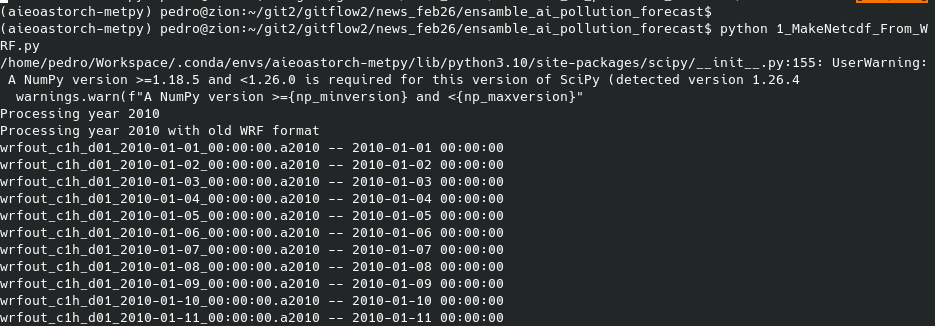
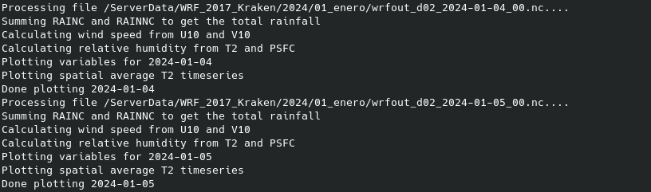
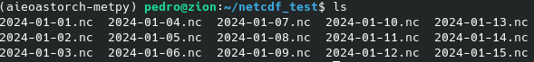
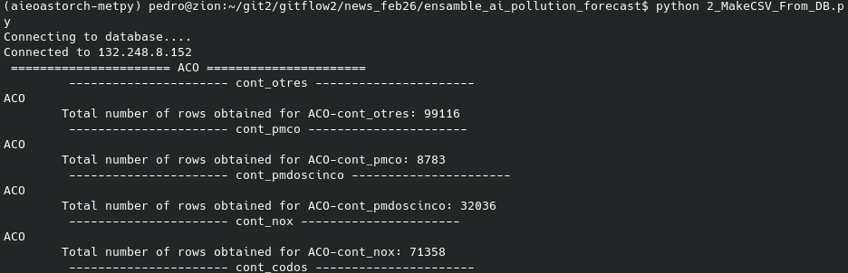
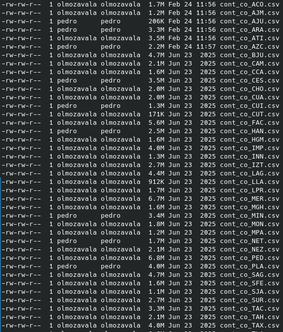
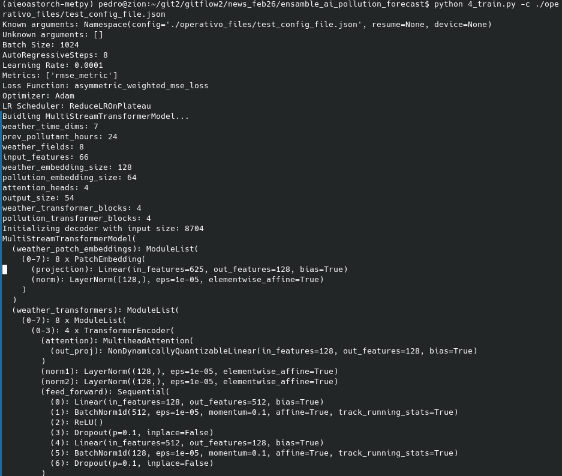
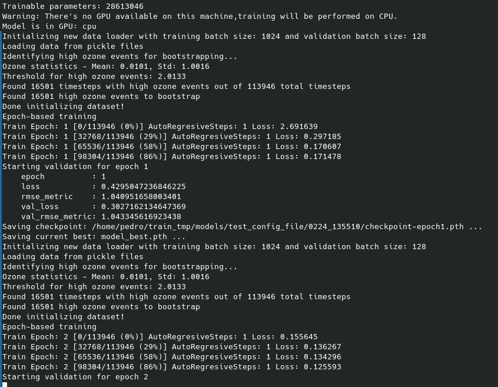

# Flujo de Trabajo del Entrenamiento

Este documento describe el flujo resumido del sistema de entrenamiento de modelos de pronóstico de contaminación atmosférica. Este proyecto de aprendizaje automático se desarrolló con la estructura y base de la plantilla de proyectos de aprendizaje automático en Pytorch: https://github.com/fsu-sc/ml_torch_templates

---

## Flujo de trabajo para entrenamientos

Se enlistan pasos principales scripts y configuracioens relevantes para cada paso.


## Diagrama de Flujo Simplificado

```
┌────────────────────────────────────────────────────────────┐
│ 1. GENERACIÓN DE BASES DE DATOS                            │
│                                                            │
│ ┌──────────────────────┐  ┌─────────────────────────────┐  │
│ │ 1_MakeNetcdf_From_   │  │ 2_MakeCSV_From_DB.py        │  │
│ │    WRF.py            │  │                             │  │
│ │                      │  │                             │  │
│ │ WRF Históricos       │  │ PostgreSQL                  │  │
│ │ (Reanálisis)         │  │ (Contaminación)             │  │
│ │                      │  │                             │  │
│ │ ↓                    │  │ ↓                           │  │
│ │ netCDFs diarios      │  │ CSVs por estación/          │  │
│ │ (Meteorología)       │  │   contaminante              │  │
│ └──────────────────────┘  └─────────────────────────────┘  │
└──────────────────────┬───────────────────┬─────────────────┘
                       │                   │
                       ▼                   ▼
┌─────────────────────────────────────────────────────────────┐
│ Datos Generados (netCDFs + CSVs)                            │
│                                                             │
│ • netCDFs diarios: {YYYY-MM-DD}.nc                          │
│ • CSVs: {contaminante}_{estacion}.csv                       │
└──────────────────────┬──────────────────────────────────────┘
                       │
                       ▼
┌─────────────────────────────────────────────────────────────┐
│ 2. CONFIGURACIÓN                                            │
│                                                             │
│ Archivo JSON de Configuración                               │
│ • Parámetros de modelo                                      │
│ • Parámetros de data loader                                 │
│ • Hiperparámetros de entrenamiento                          │
└──────────────────────┬──────────────────────────────────────┘
                       │
                       ▼
┌─────────────────────────────────────────────────────────────┐
│ 4_train.py                                                  │
│ [Entrenamiento del Modelo]                                  │
│                                                             │
│ 1. Carga configuración                                      │
│ 2. Construye modelo                                         │
│ 3. Inicializa Trainer                                       │
│    └─> Inicializa DataLoader                                │
│        ├─> Carga datos desde netCDFs y CSVs                 │
│        ├─> [Si no existe:] Genera archivo de                │
│        │   normalización (YAML)                             │
│        ├─> Normaliza datos                                  │
│        └─> Guarda datos procesados en pickle                │
│ 4. Ejecuta entrenamiento                                    │
│    ├─> Bucle de épocas                                      │
│    │   ├─> Bucle de batches                                 │
│    │   └─> Bucle autorregresivo                             │
│    └─> Guarda checkpoints                                   │
└──────────────────────┬──────────────────────────────────────┘
                       │
                       ▼
┌─────────────────────────────────────────────────────────────┐
│ Actualizar archivo JSON                                     │
│ [Actualización de Configuración]                            │
│                                                             │
└──────────────────────┬──────────────────────────────────────┘
                       │
                       ▼
┌─────────────────────────────────────────────────────────────┐
│ 5_test.py                                                   │
│ [Evaluación del Modelo]                                     │
│                                                             │
│ 1. Carga modelo entrenado (model_best.pth)                  │
│ 2. Carga datos de test                                      │
│ 3. Ejecuta inferencia autorregresiva                        │
│ 4. Genera CSVs de evaluación                                │
│    ├─> Predicciones y targets por hora                      │
│    ├─> Datos desnormalizados                                │
│    └─> Métricas (RMSE)                                      │
└─────────────────────────────────────────────────────────────┘
```

---

## Pasos Principales

### 1. Generación de netCDFs Diarios: `1_MakeNetcdf_From_WRF.py`
- **Función:** Procesa archivos WRF históricos y genera netCDFs diarios reducidos
- **Pasos principales:**
  1. Carga configuración (años, bbox, resolución, variables)
  2. Lee archivos WRF (formato antiguo ≤2018 o nuevo >2018)
  3. Procesa cada archivo: recorta, interpola, calcula variables derivadas
  4. Guarda netCDFs diarios: `{YYYY-MM-DD}.nc`
- **Salida:** Archivos netCDF diarios con 24 horas de datos meteorológicos procesados



*Figura 1. Vista general del proceso de selección de archivos WRF históricos que se usarán para generar los netCDF diarios.*



*Figura 2. Ejemplo del procesado antes de guardar los netCDF diarios.*



*Figura 3. Ejemplo de salidas de los archivos netCDF diarios generados por el script.*

### 2. Generación de CSVs de Contaminantes: `2_MakeCSV_From_DB.py`
- **Función:** Extrae datos de contaminación desde PostgreSQL
- **Pasos principales:**
  1. Conecta a PostgreSQL
  2. Para cada estación y contaminante: consulta datos históricos
  3. Guarda CSVs: `{contaminante}_{estacion}.csv`
- **Salida:** Archivos CSV con series temporales por estación y contaminante



*Figura 4. Salida inicial de 2_MakeCSV_From_DB.py muestra parámetros de conexión a la base de datos para extraer series de datos de contaminantes.*



*Figura 5. Ejemplo de archivos CSV generados por estación y contaminante a partir de la base de datos histórica.*

### 3. Configuración: Archivo JSON
- **Función:** Define parámetros de entrenamiento
- **Parámetros clave:**
  - Arquitectura del modelo
  - Parámetros del data loader (años, contaminantes, ventanas temporales)
  - Hiperparámetros (learning rate, batch size, épocas)
  - Configuración de test

### 4. Entrenamiento: `4_train.py`
- **Función:** Ejecuta el entrenamiento del modelo
- **Comando:** `python 4_train.py -c config.json`
- **Pasos principales:**
  1. Carga configuración desde JSON
  2. Construye modelo según arquitectura
  3. Inicializa DataLoader
     - Carga datos desde netCDFs y CSVs
     - [Si no existe] Genera archivo de normalización (YAML)
     - Normaliza datos
     - Guarda datos procesados en pickle
  4. Ejecuta entrenamiento (bucle de épocas, batches, pasos autorregresivos)
  5. Guarda checkpoints del modelo
- **Salida:** Modelo entrenado (`model_best.pth`), archivos de normalización, logs



*Figura 6. Ejemplo de ejecución del script de entrenamiento `4_train.py` con el archivo de configuración JSON.*



*Figura 7. Ejemplo de monitoreo del entrenamiento mostrando métricas y progreso de épocas/batches. se muestra path con salidas de modelos entrenados.*

### 5. Evaluación: `5_test.py`
- **Función:** Evalúa modelo entrenado y genera CSVs de evaluación
- **Comando:** `python 5_test.py -c config.json`
- **Pasos principales:**
  1. **Actualizar archivo JSON** (antes de ejecutar)
     - Actualizar Paths: `test.all_models_path`,`test.model_path`,`test.prediction_path`,`test.denormalization_file`
     - Actualizar `test.data_loader.years`: Años de datos para test
  2. Carga modelo entrenado (`model_best.pth`)
  3. Carga datos de test
  4. Ejecuta inferencia autorregresiva
  5. Desnormaliza predicciones y targets
  6. Guarda CSVs: `{model_name}_forecast_{hour+1}.csv`
  7. Calcula métricas (RMSE por hora)
- **Salida:** CSVs con predicciones y targets por hora pronosticada

---

## Scripts en Orden de Ejecución

### Nivel 1: Generación de Bases de Datos
1. **`1_MakeNetcdf_From_WRF.py`** - Procesa archivos WRF históricos, genera netCDFs diarios
2. **`2_MakeCSV_From_DB.py`** - Extrae datos de PostgreSQL, genera CSVs por estación/contaminante

### Nivel 2: Configuración
3. **Archivo JSON de configuración** - Define parámetros de entrenamiento

### Nivel 3: Entrenamiento
4. **`4_train.py`** - Ejecuta entrenamiento del modelo

### Nivel 4: Evaluación
5. **Actualizar archivo JSON** - Actualizar paths del modelo entrenado y rutas de predicción
6. **`5_test.py`** - Evalúa modelo y genera CSVs de evaluación

## Configuración Clave

### Parámetros del Modelo (desde config JSON):
- `prev_pollutant_hours`: Ventana de horas previas de contaminación
- `prev_weather_hours`: Ventana de horas previas de meteorología
- `next_weather_hours`: Ventana de horas futuras de meteorología
- `auto_regresive_steps`: Pasos autorregresivos durante entrenamiento
- `data_folder`: Ruta a carpeta con netCDFs y CSVs generados
- `norm_params_file`: Archivo de parámetros de normalización (se genera automáticamente)

Para más información ver documentación del configuración ./docs/ARCHIVO_config_json.md

### Rutas:
- netCDFs procesados: `{output_folder}/{YYYY-MM-DD}.nc`
- CSVs de contaminación: `{output_folder}/{contaminante}_{estacion}.csv`
- Modelo entrenado: `{save_dir}/model_best.pth`
- Archivos de normalización: `{norm_params_file}` (YAML)
- CSVs de evaluación: `{prediction_path}/{model_name}_forecast_{hour+1}.csv`

---

## Referencias

- Ver `FLUJO_ENTRENAMIENTO.md` para documentación detallada
- Ver `FLUJO_PRONOSTICO_OPERATIVO.md` para información sobre el flujo operativo
- Ver `README_parallel_training.md` para información sobre entrenamiento paralelo

